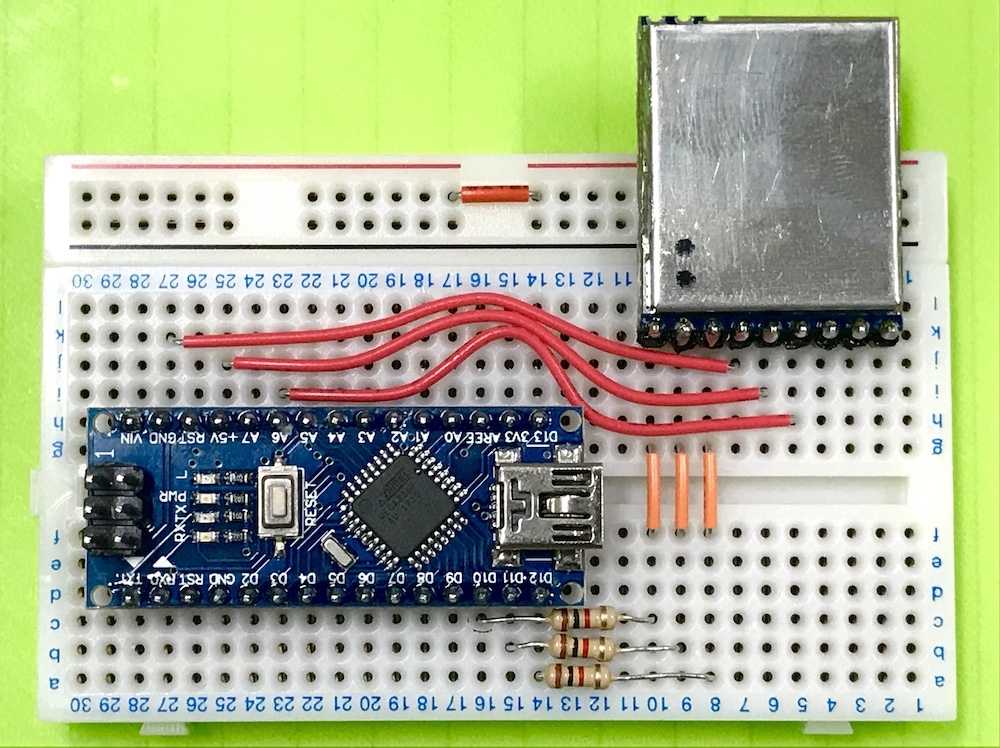
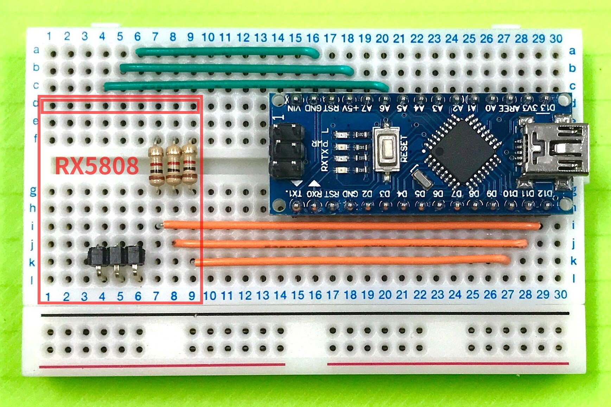
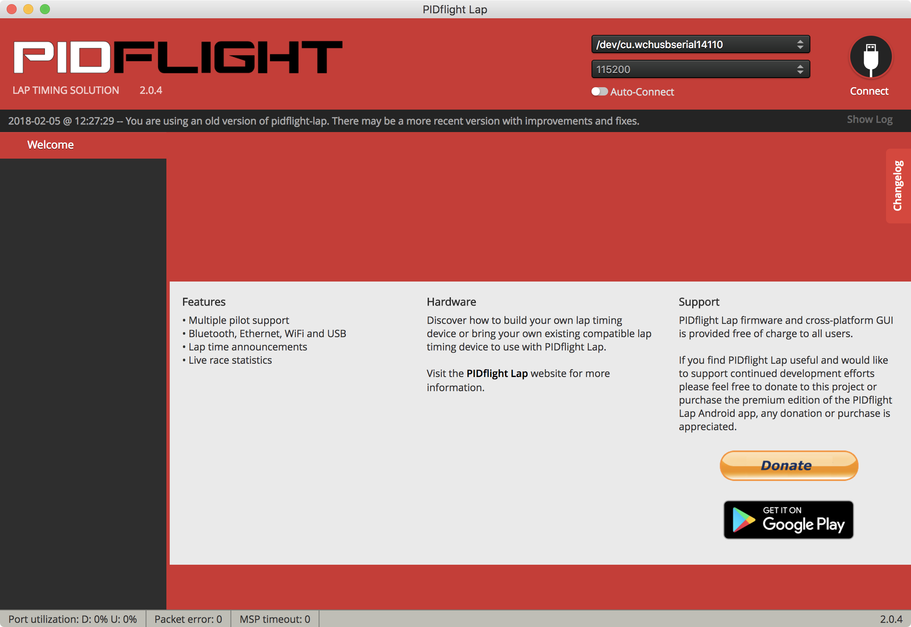
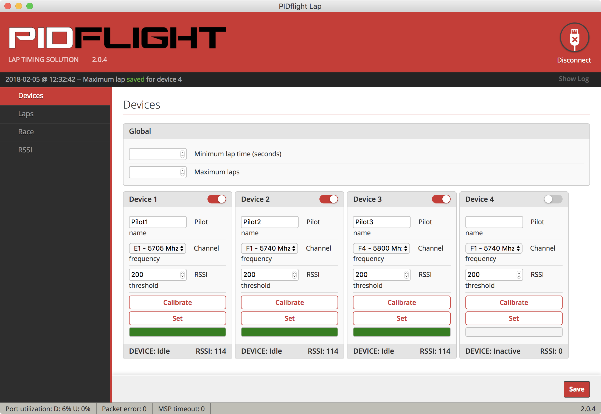
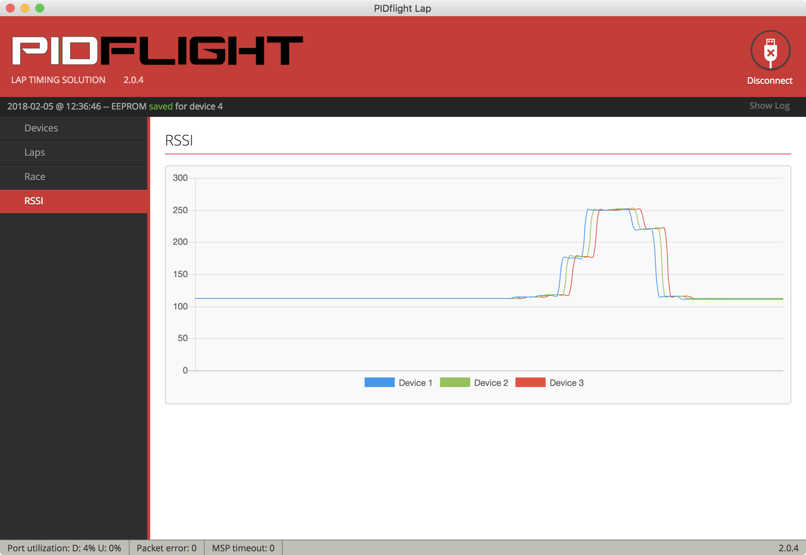

# PIDFlight Lapの評価

VTXの電波を使用した安価なラップシステム [PIDFlight Lap](https://www.pidflight.com/pidflight-lap/)
を試してみました。その手順と結果をまとめます。セットアップやアプリの実行には、MacBook Pro(High Sierra)を使用しています。

## 1. 計測デバイスの製作

[公式サイトの情報](https://www.pidflight.com/pidflight-lap/build-your-own/)を参考に、VTXラップ計測デバイスを製作します。

### 購入した物

|品名|役割|参考価格|
|---|---|--:|
| [Arduino Nano互換機](https://www.amazon.co.jp/dp/B01F741W6O/) | 受信モジュールの制御 | 400円 |
| [RX5808モジュール](https://www.banggood.com/ja/FPV-5_8G-Wireless-Audio-Video-Receiving-Module-RX5808-p-84775.html) | VTX信号の受信 | 1,010円 |
| USB miniBケーブル | PCとデバイスとの接続 | 110円 |
| [ブレッドボード](https://www.marutsu.co.jp/pc/i/110694/) | 回路の構成 | 420円 |
| [カーボン抵抗1kΩ](https://www.marutsu.co.jp/GoodsDetail.jsp?q=C041K00JT&salesGoodsCode=107022) | 回路の構成 | 120円 | 
| [ジャンパワイヤー](https://www.switch-science.com/catalog/314/) | 回路の構成 | 270円 |

参考価格の合計は2,330円となります。オプション扱いの無線通信モジュールやブザーは使用せず、MacBookとはUSBケーブルで接続しています。抵抗は3個あれば良いですが、100個単位で販売されている場合が多いようです。

RX5808モジュールは、[SPIに対応するための改造](http://wiki.rotoroverflow.com/pidflight:rx5808spimod)が必要な場合がありますが、今回購入したものは対応済みでした。対応済みであるかを知るには、金属プレートを外して回路を確認するのが確実です。

### ファームウェアの書き込み

ArduinoにPIDFlight Lapの公式ファームウェアを書き込みます。

購入したArduino互換機には、USBシリアル変換チップとしてCH340Gが搭載されていたので、事前に[CH340/CH341ドライバーMac用](http://www.wch.cn/download/CH341SER_MAC_ZIP.html)をインストールしました。

ファームウェアは2.7.0を使用しています。これは[公式サイト](https://www.pidflight.com/pidflight-lap/build-your-own/)からダウンロードできます。ファームウェアの書き込みには、Arduino IDEに同梱されるavrdudeコマンドを使用します。実行例は、以下のとおりです。

```bash
$ cd /Applications/Arduino.app/Contents/Java/hardware/tools/avr
$ cp ~/Downloads/pidflightlap_2.7.0_PDFL/pidflightlap_2.7.0_PDFL.hex .
$ ./bin/avrdude -C etc/avrdude.conf -U flash:w:pidflightlap_2.7.0_PDFL.hex:i -e -p atmega328p -b 57600 -c arduino -P /dev/tty.wchusbserial14110
$ rm pidflightlap_2.7.0_PDFL.hex
```

### 回路の製作

公式サイトの[回路図(PDF)](https://www.pidflight.com/download/303/)や[動画](https://youtu.be/JMmCdtzB3pc)を参考に、回路を製作します。今回は必要最小限の部品構成としているので、[動画で紹介されている回路図](https://youtu.be/JMmCdtzB3pc?t=21s)と同じ構成となります。

下の写真は、ブレッドボード上での配置例です。



RX5808の下の空間も利用すれば、よりコンパクトに配置できます。



本格的に使用する場合には、ユニバーサル基板等へ実装し、ケースに収めると良いでしょう。

## 2. 公式アプリでの動作確認

### アプリのインストール

[公式サイト](https://www.pidflight.com/pidflight-lap/)よりmacOS用のアプリ(GUI)2.0.4をダウンロードし、インストールします。Chrome App版でも動作や外観はほとんど同じようです。

### デバイスの基本動作

MacBookと計測デバイスをUSBケーブルで接続し、アプリを起動、計測デバイスが繋がっているシリアルポートを選択しConnectします。



計測デバイスとの接続に成功すると「Devices」の画面が表示されます。

この画面では、計測対象の周波数を設定できます。1つの物理デバイスに複数の仮想デバイスを収容して、複数の周波数を計測することが可能です。ただしその場合、計測精度は落ちます。

またこの画面では、パイロットの名前も設定できます。パイロット情報のデータベースの機能はなく、パイロットが入れ替わるたびに名前を手打ちする仕様のようです。

下の図の例では、3つの仮想デバイスに受信周波数 5705, 5740, 5800Mhzを設定し、Pilot1, Pilot2, Pilot3というパイロット名を設定しています。




「RSSI」の画面では、RSSI(受信信号強度)の変化をグラフで確認できます。例えば、5740Mhzに設定したVTXを計測デバイスの近くに置き、電源を3秒ほど投入すると、下の図のように、Device 2(5740Mhz)のRSSIが上昇することが確認できました。


RSSIのthreshold(しきい値)は、デフォルトで200となっています。この場合、RSSIが200を超えて再び200を下回るまでの区間を対象として、RSSIのピークのタイミング(=ドローンが最も近づいたと思われるタイミング)で、ラップが記録されるようです。

ファームウェア2.7.0のマニュアルでは、次のように説明されています。

>  The RSSI threshold is used to determine when to start (craft is within the threshold) and stop (craft is now below the threshold) to capture the RSSI peak and time for the start/stop of a lap.

### 仮想デバイスと計測精度

[公式サイトの情報](https://www.pidflight.com/pidflight-lap/multipilot/)によれば、仮想デバイスを使用する場合、1つの物理デバイスの受信周波数を短い時間で次々と切り替えることで、複数の受信機を備えているかのように見せかけているようです。また、その周波数の切り替え動作は、30msごとに発生するようです。

> Please note the virtual lap timers switch between frequencies, this takes ~30 milliseconds per frequency and may affect accuracy and precision.

例えば、1つの物理デバイスに3つの仮想デバイスを収容する場合、ある1つの仮想デバイスに着目すると、90msの間に30msしか受信しないことになります。この60msの空白期間が、計測精度の低下や取りこぼしに影響するものと思われます。

実験のため、下の図のように、3つの仮想デバイスの受信周波数を、あえて全て同じ 5740Mhz に設定してみます。


この状態で、5740Mhzに設定したVTXの電源を約1秒だけ投入すると、下の図のようになりました。グラフから分かるように、全く同じ周波数を計測しているにも関わらず、仮想デバイスによってRSSIが変化するタイミングがずれています。



実運用では、この仮想デバイスに起因する誤差と、そもそもの計測方式に起因する誤差(こちらは未検証)を考慮する必要がありそうです。受信機1台で複数周波数の計測に対応している類似製品(例えば[LapRF](https://www.immersionrc.com/fpv-products/laprf/))は、同じような問題を抱えているものと思われます。

### 実機でのラップ計測

(未検証)

## 3. デバイスとの距離を稼ぐ工夫

上に挙げたような最小構成では、PCと計測デバイスをUSBケーブルで接続するため、USB規格の制限により5m以上のケーブルを使用できません。しかし、以下のような製品を使えば、30m近くまで稼げます。

### ブースター付き延長ケーブル

ブースターを内蔵して長尺に対応した延長ケーブルです。下記の製品では、15mの延長が可能です。50cmのUSB miniBケーブルとの組み合わせで、問題なく動作しました。

- [Simble USB 延長線 15m USB2.0 (PC-643) (参考価格:1,880円)](https://www.amazon.co.jp/dp/B008988WBE)

### LANケーブルで延長

こちらは、延長区間をLANケーブルで補うタイプです。下記の製品では、手元の20mのLANケーブル、50cmのUSB miniBケーブルとの組み合わせで、概ね問題なく動作しました。

- [最大40m延長 USBエクステンダー USB-LAN-EXT (参考価格:390円)](https://www.amazon.co.jp/dp/B009H0KV9O)

一点だけ問題が見つかっています。USB使用中にLANケーブルを抜いた所、macOSが強制終了しました。取り扱いには注意が必要です。

LANケーブルは、以下の製品のコストパフォーマンスが良さそうです。上記のアダプタと合わせて1,500円弱で、30mの延長が可能となります。

- [エレコム LANケーブル 30m ツメが折れない CAT5e ブルー LD-CTT/BU300 (参考価格:1,091円)](https://www.amazon.co.jp/dp/B00B42H10K)

### BluetoothやWi-Fiでの無線化

BluetoothやWi-Fiでシリアルポートを無線化するアプローチもあります。ただし、公式サイトで紹介されているモジュールHC-06とDT-06は、電波法の都合で日本では使えません。日本で使えるものとしては、以下の製品があるようです。(動作は未検証)

- [RN-42使用 Bluetooth無線モジュール評価キット (参考価格:2,400円)](http://akizukidenshi.com/catalog/g/gK-07378/)
- [ESP-WROOM-02ピッチ変換済みモジュール《シンプル版》 (参考価格:909円)](https://www.switch-science.com/catalog/2341/)

モジュール単体で見ると、後者のWi-Fiモジュールの方が安いですが、周辺回路が必要になることや設定の煩雑さを考えると、前者のBluetoothモジュールの方が有利なようです。

## 4. 複数の物理デバイスの使用

複数の仮想デバイスを使用する場合に起こる計測誤差は、物理デバイスを複数同時に使用することで改善できます。

[公式サイト](https://www.pidflight.com/pidflight-lap/multipilot/)によれば、物理デバイスを直列に繋げば良く、PCとの接続は1箇所で済むようです。物理デバイスが1つの場合と異なり、ArduinoのUSBポートは使用せず、USBシリアル変換チップ等を介してArduinoのTx/Rxピンに接続する必要があります。(動作は未検証)

以上