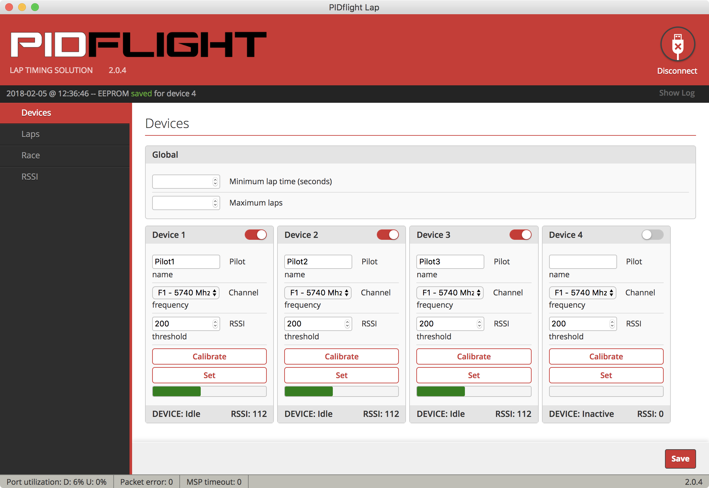

# PIDFlight Lapの評価

VTXの電波を使用した安価なラップシステム [PIDFlight Lap](https://www.pidflight.com/pidflight-lap/)
を試してみました。その手順と結果をまとめます。セットアップやアプリの実行には、MacBook Pro(High Sierra)を使用しています。

## 1. 計測デバイスの製作

[公式サイトの情報](https://www.pidflight.com/pidflight-lap/build-your-own/)を参考に、VTXラップ計測デバイスを製作します。

### 購入した物

|品名|役割|参考価格|
|---|---|--:|
| [Arduino Nano互換機](https://www.amazon.co.jp/dp/B01F741W6O/) | ラップ計測 | 400円 |
| [RX5808モジュール](https://www.banggood.com/ja/FPV-5_8G-Wireless-Audio-Video-Receiving-Module-RX5808-p-84775.html) | VTX信号の受信 | 1,010円 |
| USB miniBケーブル | 計測デバイスの接続 | 110円 |
| [ブレッドボード](https://www.marutsu.co.jp/pc/i/110694/) | 回路の構成 | 420円 |
| [カーボン抵抗1kΩ](https://www.marutsu.co.jp/GoodsDetail.jsp?q=C041K00JT&salesGoodsCode=107022) | 回路の構成 | 120円 | 
| [ジャンパワイヤー](https://www.switch-science.com/catalog/314/) | 回路の構成 | 270円 |

参考価格の合計は2,330円となります。オプション扱いの無線通信モジュールやブザーは使用せず、MacBookとはUSBケーブルで接続しています。抵抗は3個あれば良いですが、100個単位で販売されている場合が多いようです。

RX5808モジュールは、[SPIに対応するための改造](http://wiki.rotoroverflow.com/pidflight:rx5808spimod)が必要な場合がありますが、今回購入したものは対応済みでした。対応済みであるかを知るには、金属プレートを外して回路を確認するのが確実です。

### ファームウェアの書き込み

ArduinoにPIDFlight Lapの公式ファームウェアを書き込みます。

購入したArduino互換機には、USBシリアル変換チップとしてCH340Gが搭載されていたので、事前に[CH340/CH341ドライバーMac用](http://www.wch.cn/download/CH341SER_MAC_ZIP.html)をインストールしました。

ファームウェアは2.7.0を使用しています。これは[公式サイト](https://www.pidflight.com/pidflight-lap/build-your-own/)からダウンロードできます。ファームウェアの書き込みには、Arduino IDEに同梱されるavrdudeコマンドを使用します。実行例は、以下のとおりです。

```bash
$ cd /Applications/Arduino.app/Contents/Java/hardware/tools/avr
$ cp ~/Downloads/pidflightlap_2.7.0_PDFL/pidflightlap_2.7.0_PDFL.hex .
$
$ ./bin/avrdude -C etc/avrdude.conf -U flash:w:pidflightlap_2.7.0_PDFL.hex:i \
-e -p atmega328p -b 57600 -c arduino -P /dev/tty.wchusbserial14110
$
$ rm pidflightlap_2.7.0_PDFL.hex
```

### 回路の製作

公式サイトの[回路図(PDF)](https://www.pidflight.com/download/303/)や[動画](https://youtu.be/JMmCdtzB3pc)を参考に、回路を製作します。今回は必要最小限の部品構成としているので、[動画で紹介されている回路図](https://youtu.be/JMmCdtzB3pc?t=21s)と同じ構成となります。


## 2. 公式アプリでの動作確認

### アプリのインストール

[公式サイト](https://www.pidflight.com/pidflight-lap/)よりmacOS用のアプリ(GUI)2.0.4をダウンロードし、インストールします。Chrome App版でも動作や外観はほとんど同じようです。

### デバイスの基本動作

MacBookと計測デバイスをUSBケーブルで接続し、アプリを起動、計測デバイスが繋がっているシリアルポートを選択しConnectします。


計測デバイスとの接続に成功すると「Devices」の画面が表示されます。

パイロットの名前は、この画面で設定できます。パイロット情報のデータベースの機能はなく、パイロットが入れ替わるたびに名前を手打ちする仕様のようです。

また、同じ画面で計測対象の周波数を設定できます。1つの物理デバイスに複数の仮想デバイスを収容して、複数の周波数を計測することが可能です。ただしその場合、計測精度は落ちます。下の図の例では、3つの仮想デバイスに受信周波数 5705, 5740, 5800Mhzを設定しています。


「RSSI」の画面では、RSSI(受信信号強度)の変化をグラフで確認できます。例えば、5740Mhzに設定したVTXを計測デバイスの近くに置き、電源を3秒ほど投入すると、下の図のように、Device 2(5740Mhz)のRSSIが上昇することが確認できました。


RSSIのthreshold(しきい値)は、デフォルトで200となっています。この場合、RSSIが200を超えて再び200を下回るまでの区間を対象として、RSSIのピーク(=ドローンが最も近づいた)のタイミングで、ラップが記録されるものと想像できます。

### 仮想デバイスと計測精度

[公式サイトの情報](https://www.pidflight.com/pidflight-lap/multipilot/)によれば、仮想デバイスを使用する場合、1つの物理デバイスの受信周波数を短い時間で次々と切り替えることで、複数の受信機を備えているかのように見せかけているようです。また、その周波数の切り替え動作は、30msごとに発生するようです。

> Please note the virtual lap timers switch between frequencies, this takes ~30 milliseconds per frequency and may affect accuracy and precision.

例えば、1つの物理デバイスに3つの仮想デバイスを収容する場合、ある1つの仮想デバイスに着目すると、90msの間に30msしか受信しないことになります。この60msの空白期間が、計測精度の低下や取りこぼしに影響するものと思われます。

実験のため、下の図のように、3つの仮想デバイスの受信周波数を、あえて全て同じ 5740Mhz に設定してみます。



この状態で、5740Mhzに設定したVTXの電源を約1秒だけ投入すると、下の図のようになりました。グラフから分かるように、全く同じ周波数を計測しているにも関わらず、仮想デバイスによってRSSIが変化するタイミングがずれています。


実運用では、この仮想デバイスに起因する誤差と、そもそもの計測方式に起因する誤差(こちらは未検証)を考慮する必要がありそうです。受信機1台で複数周波数の計測に対応している類似製品(例えば[LapRF](https://www.immersionrc.com/fpv-products/laprf/))は、同じような問題を抱えているものと思われます。

### 実機でのラップ計測

(未実施)

## 3. 実運用での課題

### PCと計測デバイスとの距離

上に挙げたような最小構成では、PCと計測デバイスをUSBケーブルで接続するため、USB規格の制限により5m以上のケーブルを使用できません。しかし、以下のような製品を使えば、30m近くまで稼げる可能性があります(後日、動作検証を行う予定です)。

- 方法1: [ブースター付き長尺USB延長ケーブル(参考価格:1,880円)](https://www.amazon.co.jp/dp/B008988WBE)
- 方法2: [USBをLANケーブルで延長するアダプタ(参考価格:390円)](https://www.amazon.co.jp/dp/B009H0KV9O) + [長尺LANケーブル30m(参考価格: 1,100円)](https://www.amazon.co.jp/dp/B00B42H10K)

また、公式サイトにもあるように、BluetoothやWi-Fiでシリアルポートを無線化するアプローチもあります。ただし、公式サイトで紹介されているモジュールHC-06とDT-06は、電波法の都合で日本では使えません。日本で使えるものとしては、以下の製品があるようです。

- [RN-42使用 Bluetooth無線モジュール評価キット(参考価格:2,400円)](http://akizukidenshi.com/catalog/g/gK-07378/)

しかし、コスト、安定性、設定の手間を考えると、USBでの接続がお手軽に思えます。

ゲートを複数設置して、チェックポイントの通過を検知したい場合には、無線化、IP化するのが有利に思えます。しかし、そもそもPIDFlight Lapアプリにはそのような機能がないため、計測デバイスとの接続に対応したアプリを自作することになりそうです。

PIDFlight Lapのリリースノートを見ると、TCPでの接続もサポートしているようです。しかし、マニュアルには関連する記述が見当たらず、アプリ上にも設定項目がないため、詳細は不明です。

### 計測精度の改善

仮想デバイスに起因する計測誤差を無くすには、受信したい周波数の数だけ物理デバイスを用意する必要があります。[公式サイト](https://www.pidflight.com/pidflight-lap/multipilot/)によれば、物理デバイスを直列に繋げば良く、PCとの接続は1ポートで済むようです。


以上