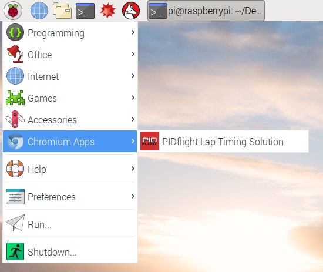
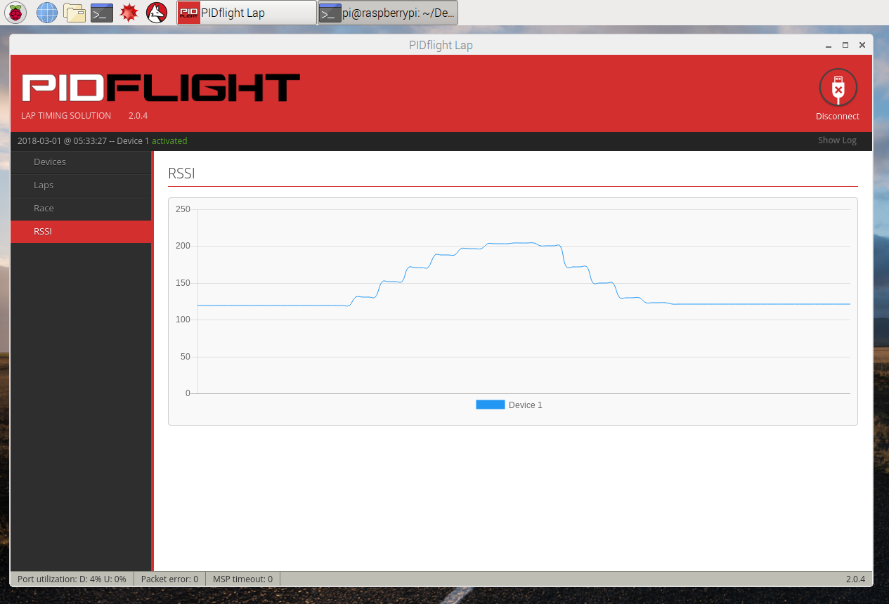

# PIDflight LapをRapsberry Pi上で動かす

[PIDflight Lap](https://www.pidflight.com/pidflight-lap/)というラップ計測システムを、Raspberry Pi上で動かしてみます。通常はPCやスマホを前提としたシステムですが、今回は低価格で据え置きに適した物という視点で、Raspberry Piを選択しました。

## 計測デバイス

[こちらの資料](https://github.com/t-asano/techlog/blob/master/lapsystem/pidflight_lap.md)を参考に、Aruduino Nano互換機とRX5808(FPV映像受信モジュール)を使った計測デバイスを製作します。費用は3,000円弱です。

## 管理アプリ

PIDflight Lapの公式サイトで公開されている管理アプリ(GUI)を、Raspberry Piに組み込みます。アプリは無償で利用できます(寄付も可能です)。

### Raspberry Piの調達

今回は「Raspberry Pi 3 Model B」を使用します。PIDflight Lapはそれほど負荷が高くないので、より低価格なRaspberry Pi Zeroシリーズでも事足りそうですが、動作は未検証です。はじめてRaspberry Pi 3を購入する場合は、[Raspberry Pi 3 スターターキット](https://www.switch-science.com/catalog/3559/)(参考価格:10,530円)が便利です。

### OSのインストール

以下の手順で、Raspberry PiにOS(Raspbian)を組み込みます。

1. [Raspbian Stretch with desktop](https://www.raspberrypi.org/downloads/raspbian/)のディスクイメージをダウンロード
2. [SDメモリカードフォーマッター](https://www.sdcard.org/jp/downloads/formatter_4/index.html)等を使用して、microSDカードをフォーマット
3. [Win32 Disk Imager](https://sourceforge.net/projects/win32diskimager/files/)等を使用して、microSDカードにディスクイメージを書き込み
4. Raspberry PiにmicroSDカードを挿入、HDMIモニター、USBキーボード、USBマウスを接続して電源を投入
5. OSが起動したら言語やタイムゾーンを設定

### アプリのインストール

以下の手順で、PIDflight Lapのアプリ(GUI)をインストールします。

1. [PIDflight Lapの公式サイト](https://www.pidflight.com/pidflight-lap/)よりChrome向けのパッケージをダウンロード
- Raspberry PiのChromiumアプリの拡張機能の管理画面を開く
- ダウンロードしたパッケージに含まれるcrxファイルを拡張機能の管理画面にドロップ

これでインストールは完了です。

### アプリの起動

インストールしたPIDflight Lapは、Raspbianのメニューの「Chromium Apps」に登録されています。ここからPIDflight Lapを起動できます。



Chromiumへの対応は公式には謳われていませんが、問題無く動くようです。



### Raspberry Piのシャットダウン

Raspberry Piの電源を落とす場合には注意が必要です。デスクトップPCと同様に、稼働中にいきなり電源ケーブルを抜くとディスクが破損する恐れがあります。これを避けるために、必ずRaspbianのメニューからシャットダウンを実行してください。

## 使用方法

計測デバイスおよび管理アプリの使用方法については、[公式サイト](https://www.pidflight.com/pidflight-lap/)及び[こちらの文書](https://github.com/t-asano/techlog/blob/master/lapsystem/pidflight_lap.md)を参考にしてください。

## コンポジット出力

Rapberry Piはコンポジット映像の出力にも対応しています。

コンポジット出力対応のFPV受信機及び、コンポジット入力対応の映像分割機と組み合わせることで、FPV映像とラップシステムを4分割画面に表示する、といった活用が可能です。

### ケーブルの調達

4極ケーブルを使用して、コンポジット映像を取り出します。適合については調査中です。

### コンポジット出力の有効化

Rapberry Piのコンポジット出力を有効にするには、/boot/config.txt に以下の設定をおこないます。

```
sdtv_mode=1
```

sdtv_modeの数字は、以下のような意味を持っているようです。

```
sdtv_mode=0    Normal NTSC
sdtv_mode=1    Japanese version of NTSC – no pedestal
sdtv_mode=2    Normal PAL
sdtv_mode=3    Brazilian version of PAL – 525/60 rather than 625/50, different subcarrier
```