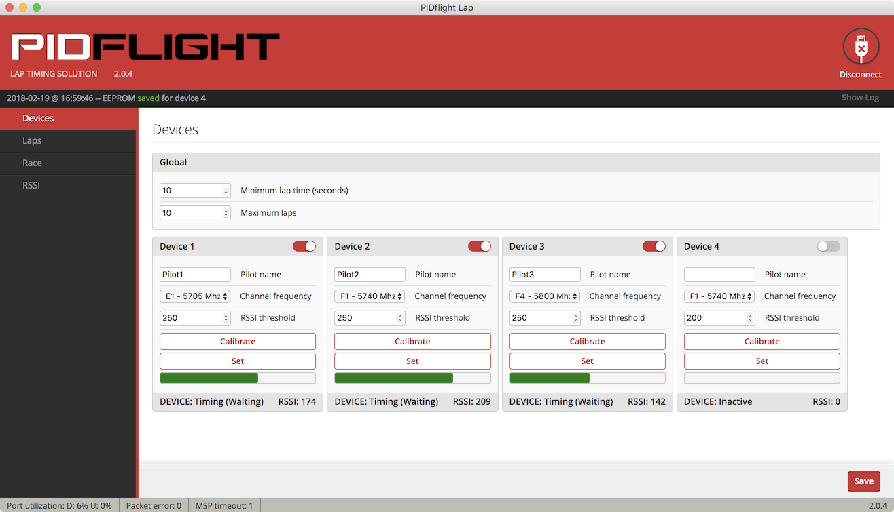

# PIDflight Lapの評価

VTXの電波を使用した安価なラップシステム [PIDflight Lap](https://www.pidflight.com/pidflight-lap/)
を試してみました。その手順と結果をまとめます。セットアップやアプリの実行には、MacBook Pro(High Sierra)を使用しています。

## 1. 計測デバイスの製作

[公式サイトの情報](https://www.pidflight.com/pidflight-lap/build-your-own/)を参考に、VTXラップ計測デバイスを製作します。

### 必要な物

|品名|役割|参考価格|
|---|---|--:|
| [Arduino Nano互換機](https://www.banggood.com/ja/ATmega328P-Arduino-Compatible-Nano-V3-Improved-Version-No-Cable-p-959231.html) | 受信モジュールの制御 | 330円 |
| [RX5808モジュール](https://www.banggood.com/ja/FPV-5_8G-Wireless-Audio-Video-Receiving-Module-RX5808-p-84775.html) | VTX信号の受信 | 1,010円 |
| [ピンヘッダ 20ピン](https://www.marutsu.co.jp/pc/i/65522/) | RX5808に取り付け | 60円 |
| [USB miniBケーブル 5m](https://www.amazon.co.jp/dp/B077XVNT2N) | PCとデバイスとの接続 | 390円 |
| [ブレッドボード](https://www.switch-science.com/catalog/3499/) | 回路の構成 | 400円 |
| [抵抗 1kΩ 3個(100個入)](https://www.marutsu.co.jp/GoodsDetail.jsp?q=C041K00JT&salesGoodsCode=107022) | 回路の構成 | 120円 |
| [ジャンパワイヤー](https://www.switch-science.com/catalog/314/) | 回路の構成 | 270円 |

参考価格の合計は2,580円(税込・送料別)となります。オプション扱いの無線通信モジュールやブザーは使用せず、MacBookとはUSBケーブルで接続しています。

ピンヘッダは9ピンあれば良いですが、20ピン位までは価格は固定のようです。抵抗は3個あれば良いですが、100個単位で販売されている場合が多いようです。

RX5808モジュールは、[SPIに対応するための改造](http://wiki.rotoroverflow.com/pidflight:rx5808spimod)が必要な場合がありますが、今回購入したものは対応済みでした。対応済みであるかを知るには、金属プレートを外して回路を確認するのが確実ですが、PIDflight Lapのファームウェアを書き込んで動作を確認するという荒技もあるようです。

### ファームウェアの書き込み

ArduinoにPIDflight Lapの公式ファームウェアを書き込みます。

[購入したArduino互換機(上記の「必要な物」のリンク先とは別の製品)](https://www.amazon.co.jp/dp/B01F741W6O)には、USBシリアル変換チップとしてCH340Gが搭載されていたので、事前に[CH340/CH341ドライバーMac用](http://www.wch.cn/download/CH341SER_MAC_ZIP.html)をインストールしました。

ファームウェアは2.7.0を使用しています。これは[公式サイト](https://www.pidflight.com/pidflight-lap/build-your-own/)からダウンロードできます。ファームウェアの書き込みには、Arduino IDEに同梱されるavrdudeコマンドを使用します。実行例は、以下のとおりです。

```bash
$ cd /Applications/Arduino.app/Contents/Java/hardware/tools/avr
$ cp ~/Downloads/pidflightlap_2.7.0_PDFL/pidflightlap_2.7.0_PDFL.hex .
$ ./bin/avrdude -C etc/avrdude.conf -U flash:w:pidflightlap_2.7.0_PDFL.hex:i -e -p atmega328p -b 57600 -c arduino -P /dev/tty.wchusbserial14110
$ rm pidflightlap_2.7.0_PDFL.hex
```

### 回路の製作

公式サイトの[回路図(PDF)](https://www.pidflight.com/download/303/)や[動画](https://youtu.be/JMmCdtzB3pc)を参考に、回路を製作します。今回は必要最小限の部品構成としており、[動画で紹介されている回路図](https://youtu.be/JMmCdtzB3pc?t=21s)と同じ構成となります。

下の写真は、ブレッドボード上での配置例です。


RX5808の下の空間を利用すれば、よりコンパクトに配置できます。左下の黒い部品は、RX5808の傾きを防ぐスペーサーです。ピンヘッダの部品を流用しています。


RX5808にアンテナを接続せずに使用する場合、[金属シールドの反対面を計測対象に向けると良い](https://github.com/voroshkov/Chorus-RF-Laptimer/blob/master/README.md)との情報を頂きました。

> I tried using different types of antennas and shields with RX5808 to achieve the best possible accuracy, and finally found that the module itself works as a short-range directional antenna. The non-shielded side of the module is a surface that should face the gate, so consider this fact upon assembling.

これによると、下手にアンテナやシールドを追加するよりも、アンテナなしでシールドの反対面を向けるのが良い(短距離向け指向性アンテナとして機能する)ようです。

シールドの反対面を計測対象に向けるには、RX5808を裏返しで取り付けるか、ブレッドボードから突き出る形で配置するのが良いでしょう。私は、シールド上向き前提でピンヘッダを取り付け済みだったため、後者の方法を採りました。

ブレッドボードを使った回路は、最終的に以下のようになりました。食品保存用のケース「[イデアルID-404 長角ミニ3P](http://www.inomata-k.co.jp/item/series.php?sid=42)」(参考価格：3個110円)に収めています。ブレッドボードは、両面テープでケースに固定してあります。


### ブザーの追加

ブザーを追加すると、計測デバイスの動作状況を把握しやすくなります。

5Vで駆動する自励式ブザーが適合するようなので、[こちらの製品](https://www.marutsu.co.jp/GoodsDetail.jsp?salesGoodsCode=64925)を公式の回路図通り5VとD6の間に置いたのですが、なぜか全く発音しません。原因を調査中です。

## 2. 公式アプリでの動作確認

### アプリのインストール

[公式サイト](https://www.pidflight.com/pidflight-lap/)よりmacOS用のアプリ(GUI)2.0.4をダウンロードし、インストールします。Chrome App版でも動作や外観はほとんど同じようです。

### デバイスの基本動作

MacBookと計測デバイスをUSBケーブルで接続し、アプリを起動、計測デバイスが繋がっているシリアルポートを選択しConnectします。


計測デバイスとの接続に成功すると「Devices」の画面が表示されます。

この画面では、計測対象の周波数を設定できます。1つの物理デバイスに複数の仮想デバイスを収容して、複数の周波数を計測することが可能です。ただしその場合、計測精度は落ちます。

またこの画面では、パイロットの名前も設定できます。パイロット情報のデータベースの機能はなく、パイロットが入れ替わるたびに名前を手打ちする仕様のようです。

下の図の例では、3つの仮想デバイスに受信周波数 5705, 5740, 5800Mhzを設定し、Pilot1, Pilot2, Pilot3というパイロット名を設定しています。


「RSSI」の画面では、RSSI(受信信号強度)の変化をグラフで確認できます。例えば、5740Mhzに設定したVTXを計測デバイスの近くに置き、電源を3秒ほど投入すると、下の図のように、Device 2(5740Mhz)のRSSIが上昇することが確認できました。


RSSIのthreshold(しきい値)は、デフォルトで200となっています。この場合、RSSIが200を超えて再び200を下回るまでの区間を対象として、RSSIのピークのタイミング(=ドローンが最も近づいたと思われるタイミング)で、ラップが記録されるようです。

ファームウェア2.7.0のマニュアルでは、次のように説明されています。

>  The RSSI threshold is used to determine when to start (craft is within the threshold) and stop (craft is now below the threshold) to capture the RSSI peak and time for the start/stop of a lap.

### 仮想デバイスと計測精度

[公式サイトの情報](https://www.pidflight.com/pidflight-lap/multipilot/)によれば、仮想デバイスを使用する場合、1つの物理デバイスの受信周波数を短い時間で次々と切り替えることで、複数の受信機を備えているかのように見せかけているようです。また、その周波数の切り替え動作は、30msごとに発生するようです。

> Please note the virtual lap timers switch between frequencies, this takes ~30 milliseconds per frequency and may affect accuracy and precision.

例えば、1つの物理デバイスに3つの仮想デバイスを収容する場合、ある1つの仮想デバイスに着目すると、90msの間に30msしか受信しないことになります。この60msの空白期間が、計測精度の低下や取りこぼしに影響するものと思われます。

実験のため、下の図のように、3つの仮想デバイスの受信周波数を、あえて全て同じ 5740Mhz に設定してみます。


この状態で、5740Mhzに設定したVTXの電源を約1秒だけ投入すると、下の図のようになりました。グラフから分かるように、全く同じ周波数を計測しているにも関わらず、仮想デバイスによってRSSIが変化するタイミングがずれています。


実運用では、この仮想デバイスに起因する誤差と、そもそもの計測方式に起因する誤差(こちらは未検証)を考慮する必要がありそうです。受信機1台で複数周波数の計測に対応している類似製品(例えば[LapRF](https://www.immersionrc.com/fpv-products/laprf/))は、同じような問題を抱えているものと思われます。

### ドローン実機でのテスト1回目(2018.2.17)

72畳の和室の半面にコースを設置し、テストを行いました。写真の右端にある2つのフープの付近に計測デバイスを置いています(この後、フープを挟むようにもう一台机を置きました)。


結果としては、ドローンがどこにいてもRSSIが高めの値を示しており、thresholdの設定がかなりシビアに感じました。また、計測デバイスとの距離が遠くても高度が高いとRSSIが高い値を示すこともあり、アンテナの指向性への配慮も必要と感じました。

とはいえ、ドローンが計測デバイスの直近を通れば、他の場所より高い値を示すことは確認できたので、thresholdをできる限り高く設定すべくテストを繰り返しました。しかし、この日のテストでは、どれだけthresholdの設定を煮詰めても、せいぜい1回しかラップが計れないという、不可解な現象に悩まされました。

### ドローン実機でのテスト2回目(2018.2.19)

PIDflight Lapの動作をじっくりと観察したところ、重大な事に気づきました。

「Devices」の画面に「Maximum laps」の設定欄があるのですが、2月17日のテストではここを空欄としていました。「空欄であれば何回でもラップが計測できる」と思い込んでいたのですが、この状態では、どうやら1回だけ計測できないようです。この仕様に気づかずに「なかなか上手く計測できない」と感じていた可能性が高いです。

確証を得るために、システムを完全に初期状態(ファームウェアとアプリを入れ直す)に戻した上で、Maximum lapsを空欄のままSaveし、RaceをStartしたところ、やはりラップを1回だけ計測して終了しました。このとき、Lapの画面では周回数の分母が不定(-)となっていました。

PIDflight Lapの開発者に確認したところ、空欄の場合は0が設定されて、そのような誤動作を引き起こすのかもしれないとのこと。レースの前には必ずMaximum lapの値を設定するのが良さそうです。



試しに「Maximum laps」に「10」を設定してみたところ、ようやく想定に近い挙動となりました。

### ドローン実機でのテスト3回目(2018.3.4)

[TAKIDENKI JAPAN](http://www.takidenki.co.jp/takidenkijapan/index.html)さんにお邪魔して、テストを行いました。

コースは下の写真のように、左側の混み入ったゾーンと、右側のエスカレーター/階段を活かした直線的なゾーンから構成されています。このゾーンの境目(写真中央のバルーンゲートの下)に計測デバイスを置きました。


左側のゾーンを中心に飛ばした場合には、RSSIが常に200台後半を示しており、thresholdの設定が非常にシビアで、誤判定も多かった印象です。

その後、左側のゾーンであまり複雑に飛ばさず、右側のゾーンとテンポよく行き来するようなルートに変更したところ、エスカレーター/階段の頂点でRSSIが明確に下がることで、まずまず期待通り結果が得られました。当日は試せませんでしたが、エスカレーターの途中に計測デバイスを置き、Minimum lap timeを適切に設定すれば、より正確な結果が得られるはずです。

室内フライトの場合、狭い空間の中で飛ばすことが多いと思いますが、このような場合、VTXを使用したラップシステムはどうしても不利になります。他の区間からなるべく離れた位置にストレート区間を設け、その中央に計測デバイスを置くのが理想です。さらに、Calibrateの機能を活用しながら、thresoldの設定をギリギリまで詰める必要があるでしょう。

そもそもRSSIが飽和しているのでは？との指摘も頂いており、計測デバイスにシールドを設ける等してRSSIの値を減少させるという対策も、試してみる価値がありそうです。

## 3. PIDflight Lap使用時の注意点

いくつか注意すべき点が分かってきましたので、以下にまとめます。

- ラップ計測は、RaceをStartしないと始まらない
	- RaceをStartした後、1回目のゲート通過をきっかけに計測が始まる
	- ゲートの手前に十分に距離をとってスタートラインを置くと良い
- Maximum lapsで設定した回数だけ計測される
	- Raceの前に、この値が設定されていることを必ず確認すること
	- 空欄のままにしておくと1周しか計測できないので注意
- Minimum lap timeを設定しておくと誤計測を減らせる
	- 例えば1週最速20秒のコースなら15秒等に設定すると良い
- Devicesの状態表示(Idle/Waiting/Start/Stop)が参考になる
	- Idleは、RaceをStartしていない状態
	- Waitingは、Start後に1回もゲートを通過していない状態
	- Startは、1回ゲートを通過して計測が開始された状態
	- Stopは、最大ラップ数に達して計測が終了した状態
- PCアプリの使い方は、[スマホアプリのマニュアル](https://www.pidflight.com/download/298/)も参考になる

## 4. 計測デバイスとの距離の確保

上に挙げたような最小構成では、PCと計測デバイスをUSBケーブルで接続するため、USB規格の制限により5mを超えるケーブルを使用できません。しかし、以下のような製品を使えば、20〜40mまで伸ばすことができます。

### ブースター付き延長ケーブル

ブースターを内蔵することで長尺に対応した延長ケーブルです。下記の製品では、15mの延長が可能です。0.5mのUSB miniBケーブルとの組み合わせで、問題なく動作しました。(5mのUSBケーブルとの組み合わせは未検証です)

- [Simble USB 延長線 15m USB2.0 (PC-643) (参考価格:1,880円)](https://www.amazon.co.jp/dp/B008988WBE)

### LANケーブルで延長するためのアダプタ

こちらは延長区間をLANケーブルで繋ぎます。下記の製品では、20mのLANケーブル、5mのUSB miniBケーブルとの組み合わせで、概ね問題なく動作しました。

- [最大40m延長 USBエクステンダー USB-LAN-EXT (参考価格:390円)](https://www.amazon.co.jp/dp/B009H0KV9O)

一点だけ問題が見つかりました。USB使用中にLANケーブルを抜いたところ、macOSが強制終了しました。取り扱いには注意が必要です。

LANケーブルは、以下の製品のコストパフォーマンスが良さそうです。上記のアダプタと合わせて1,500円弱で、30m超の延長が可能となります。

- [エレコム LANケーブル 30m ツメが折れない CAT5e ブルー LD-CTT/BU300 (参考価格:1,091円)](https://www.amazon.co.jp/dp/B00B42H10K)

### BluetoothやWi-Fiで無線化

BluetoothやWi-Fiでシリアルポートを無線化するアプローチもあります。ただし、公式サイトで紹介されているモジュールHC-06とDT-06は、電波法の都合で日本では使えません。日本で使えるものとしては、以下の製品があるようです。(動作は未検証)

- [RN-42使用 Bluetooth無線モジュール評価キット (参考価格:2,400円)](http://akizukidenshi.com/catalog/g/gK-07378/)
- [ESP-WROOM-02ピッチ変換済みモジュール《シンプル版》 (参考価格:909円)](https://www.switch-science.com/catalog/2341/)

モジュール単体で見ると、後者のWi-Fiモジュールの方が安いですが、周辺回路が必要になることや設定の煩雑さを考えると、前者のBluetoothモジュールの方が有利なようです。

現実的な最大距離は、Bluetoothで20m、Wi-Fiで50m程度と考えておくと良いかもしれません。これは現場の状況によっても大きく異なるため、注意が必要です。

### 結局どれを選ぶか

部品のコスト、設定の手間、接続の安定性、プロポの電波との干渉、電源の確保等を考えると、USBを延長するアプローチが確実です。20m程度でよければブースター付きのUSB延長ケーブル、40m近くまで伸ばしたければLANケーブルで延長するためのアダプタを使用すると良いでしょう。

一方で、屋外で使用する場合や、計測デバイスを複数箇所に配置するような場合には、取り回しの良さで無線が有利と思われます。

## 5. 複数の物理デバイスの使用

複数の仮想デバイスを使用する場合に起こる計測誤差は、物理デバイスを複数同時に使用することで改善できます。

[公式サイト](https://www.pidflight.com/pidflight-lap/multipilot/)によれば回路はシンプルで、物理デバイスを直列に繋げば良く、PCとの接続は1箇所で済むようです。有線で接続する場合、ArduinoのUSBポートは使用せず、Tx/Rxピンに接続することになります。そのためには、USBシリアル変換モジュールの追加が必要となりそうです。

以上