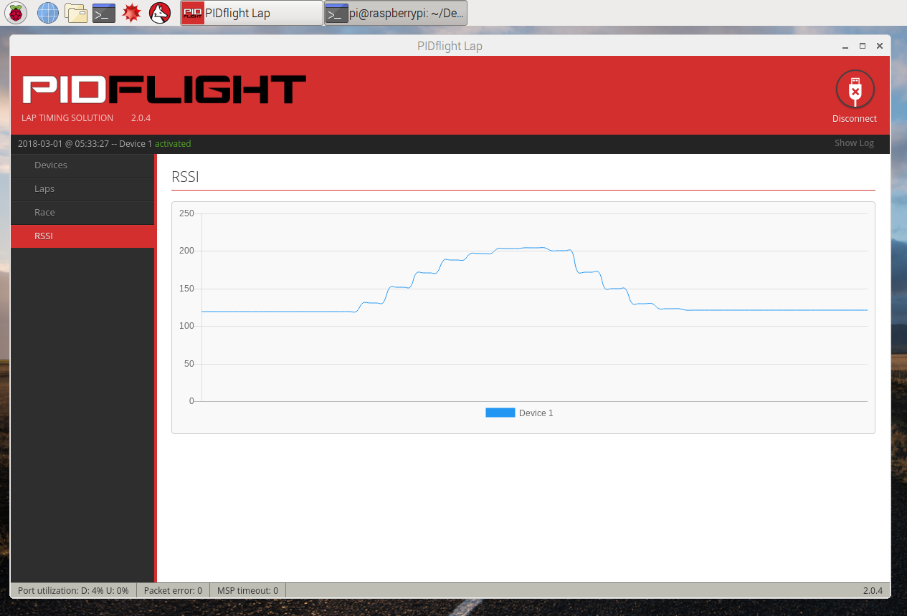
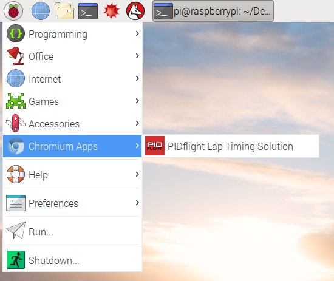

# 常設向け簡易マルチビューア＆ラップシステムの検討

## ご注意

この文書を元に起こる、あらゆる不都合や損害について、作者は一切責任を負いません。リスクを理解した上で、ご活用頂ければ幸いです。

## 1. マルチビューア

コンポジット映像出力付きのFPV映像受信機と、コンポジット映像用の映像分割機を組み合わせると、簡易的なマルチビューアシステムを構築できます。

PCを使用せず、とにかく安く、簡単に、4分割画面が出せて、表示の自由度や画質に関しては多くを望まない、というスタンスのシステムとなります。

### 1.1. パーツ構成

(ここに全体の写真を載せる)

**※動作未検証のため仮の構成です**

| 品名 | 役割 | 参考価格(税込) |
| :-- | :-- | --: |
| [ACアダプター 12V 1A](https://www.marutsu.co.jp/pc/i/743618/) | 電源の供給 | 1170円 |
| [DCジャック付きケーブル 2.1mm](https://www.marutsu.co.jp/pc/i/594850/) | ACアダプタの接続 | 250円 |
| [エーモン プラス・マイナス分岐ターミナル](https://www.amazon.co.jp/dp/B005LBE5AO) | 電源の分岐 | 470円 |
| [Eachine RC832 × 3個](https://www.banggood.com/ja/Eachine-FPV-5_8G-32CH-Wireless-AV-Receiver-RC832-p-975426.html) | FPV映像の受信 | 4,800円 |
| [MAXWIN AV-400](https://www.amazon.co.jp/dp/B010UOUDMA) | 映像の4分割表示 | 7,320円 |

参考価格の合計は14,010円(税込、送料別)となります。

映像分割機はAV-400を選んでいますが、これの互換品と思われる「[Auto Wayfeng WF® マルチカメラスプリッタ](https://www.amazon.co.jp/Auto-Wayfeng-WF®-マルチカメラスプリッタ/dp/B06XRMBY9P/)」(参考価格:4,300円)という製品も存在します。動作は未検証ですが、問題なく動くのであれば約3,000円のコストダウンが可能です。

電源分岐ターミナルとRC832を接続する際に、RC832の電源ケーブルを切断加工します。これを避けるには、別途JSTプラグケーブルを用意すると良いでしょう。

### 1.2. PAL/NTSCの問題

ドローンのVTXから送信される映像の方式は、PALだったりNTSCだったりまちまちです。これをRC832で受信すると、おそらく入力側と出力側の映像方式が同じとなります。つまり、PALで受信すればPALで出力、NTSCで受信すればNTSCで出力されるものと予想されます(要検証)。

映像分割機AV-400の入力は、PALとNTSCの両方に対応しており、入力端子1の映像方式が出力側に引き継がれるようです。また、入力側にPALとNTSCが混在した場合にも、映像の分割表示には大きな支障はないようです(要検証)。

先ほど説明したように、AV-400の出力側の映像方式はPALだったりNTSCだったり環境によってまちまちです。一方で、日本で売られているテレビやレコーダーのコンポジット入力は、NTSCにしか対応していない場合が多いと考えられます。そのような機器にPALの映像を入力すると、白黒になったり、垂直方向に映像が流れたりする可能性があります(要検証)。

これを解決するために、最終段でPALからNTSCの変換を行います。次に挙げるような、PAL/NTSCに両対応した、コンポジット->HDMIコンバーターで代用することも可能です。

| 品名 | 役割 | 参考価格(税込) |
| :-- | :-- | --: |
| [Wavlink AV2HDMI](https://www.amazon.co.jp/gp/product/B073XLY9TJ) | HDMIへの変換 | 1,300円 |


### 1.3. 使用方法

使用方法は、以下の通り、とても簡単です。

1. システム全体の電源を投入
- RC832の受信周波数を設定
- AV-400の画面分割方法を設定

終了したい場合には、電源を切断するだけOKです。

## 2. ラップシステム

[PIDflight Lap](https://www.pidflight.com/pidflight-lap/)というオープンソースのラップ計測システムを、Arduino及びRaspberry Piに組み込んで使用します。

通常はPCやスマホを中心としたシステムになりますが、今回は低価格で据え置きに適した物であることを重視し、Raspberry Piを選択しています。

### 2.1. 計測デバイス

[こちらの資料](https://github.com/t-asano/techlog/blob/master/lapsystem/pidflight_lap.md)を参考に、Aruduino Nano互換機とRX5808(FPV映像受信モジュール)を使った計測デバイスを製作します。費用は3,000円弱です。

### 2.2. 管理アプリ

PIDflight Lapの公式サイトで公開されている管理アプリ(GUI)を、Raspberry Piに組み込みます。アプリは無償で利用できます(寄付も可能です)。

#### Raspberry Piの調達

検証には「Raspberry Pi 3 Model B」を使用しています。PIDflight Lapはそれほど負荷が高くないので、より低価格なRaspberry Pi Zeroシリーズでも事足りそうですが、動作は未検証です。はじめてRaspberry Piを購入される場合は、[Raspberry Pi 3 スターターキット](https://www.switch-science.com/catalog/3559/)(参考価格:10,530円)が便利です。

#### OSのインストール

以下の手順で、Raspberry PiにOS(Raspbian)を組み込みます。

1. [Raspbian Stretch with desktop](https://www.raspberrypi.org/downloads/raspbian/)のディスクイメージをダウンロード(今回は2017-11-29版を使用)
- [SDメモリカードフォーマッター](https://www.sdcard.org/jp/downloads/formatter_4/index.html)等を使用して、microSDカードをフォーマット
- [Win32 Disk Imager](https://sourceforge.net/projects/win32diskimager/files/)等を使用して、microSDカードにディスクイメージを書き込み
- Raspberry PiにmicroSDカードを挿入、HDMIモニター、USBキーボード、USBマウスを接続して電源を投入
- OSが起動したら言語やタイムゾーンを設定

#### 管理アプリのインストール

以下の手順で、PIDflight Lapの管理アプリ(GUI)をインストールします。

1. [PIDflight Lapの公式サイト](https://www.pidflight.com/pidflight-lap/)よりChrome向けのパッケージをダウンロード
- Raspberry PiのChromiumアプリの拡張機能の管理画面を開く
- ダウンロードしたパッケージに含まれるcrxファイルを拡張機能の管理画面にドロップ

これでインストールは完了です。Chromiumへの対応は公式には謳われていませんが、問題無く動くことが確認できています。



#### アプリの起動

インストールしたPIDflight Lapは、Raspbianのメニューの「Chromium Apps」に登録されています。ここからPIDflight Lapを起動できます。



#### Raspberry Piのシャットダウン

Raspberry Piの電源を落とす場合は注意が必要です。デスクトップPCと同様に、稼働中にいきなり電源ケーブルを抜くとディスクが破損する恐れがあります。これを避けるために、必ずRaspbianのメニューからシャットダウンを実行してください。

### 2.3. 使用方法

計測デバイおよび管理アプリの使用方法については、[公式サイト](https://www.pidflight.com/pidflight-lap/)及び[こちらの文書](https://github.com/t-asano/techlog/blob/master/lapsystem/pidflight_lap.md)を参考にしてください。

## 3. 全ての映像の統合

Rapberry Piはコンポジット出力にも対応しています。これを活用してAV-400にRaspbery Piの映像を入力することで、FPV映像3枚、PIDflight Lap(Raspberry Pi)の映像1枚から構成される4分割映像を出力できます。

### 3.1. ケーブルの調達

(調査中)

### 3.2. コンポジット出力の有効化

Rapberry Piのコンポジット出力を有効にするには、/boot/config.txt に以下の設定をおこないます。

```
sdtv_mode=1
```

sdtv_modeの数字は、以下のような意味を持っているようです。

```
sdtv_mode=0    Normal NTSC
sdtv_mode=1    Japanese version of NTSC – no pedestal
sdtv_mode=2    Normal PAL
sdtv_mode=3    Brazilian version of PAL – 525/60 rather than 625/50, different subcarrier
```

AV-400の入力側にPALとNTSCが混在していて、分割映像が乱れるようであれば、あえて2(Normal PAL)に設定するのも良いかもしれません。当然その場合には、最終段でのPAL->NTSC変換またはコンポジット(PAL/NTSC)->HDMI変換が必須となります。

### 3.3. 実際の稼働例

(ここに全体の写真を載せる)