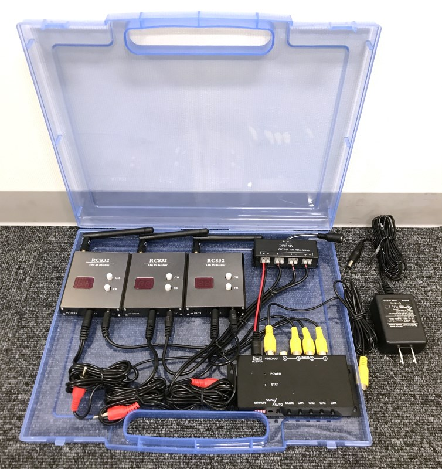
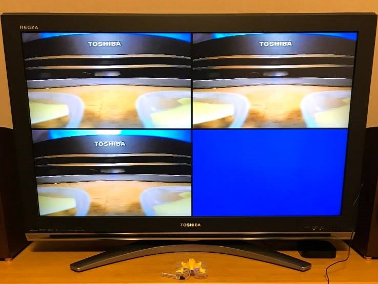
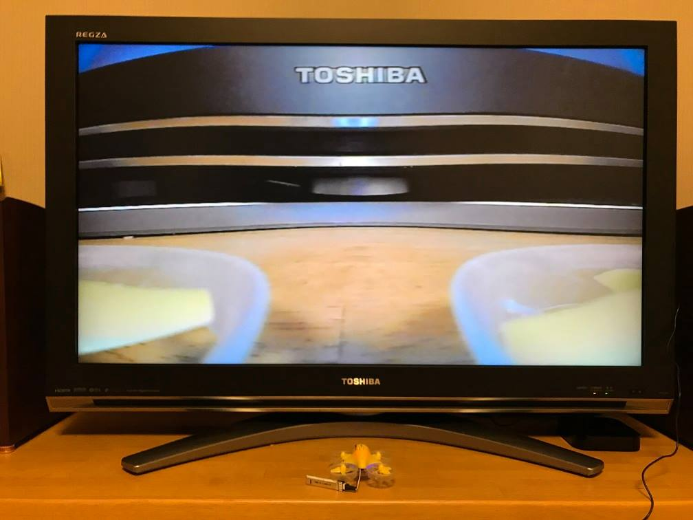
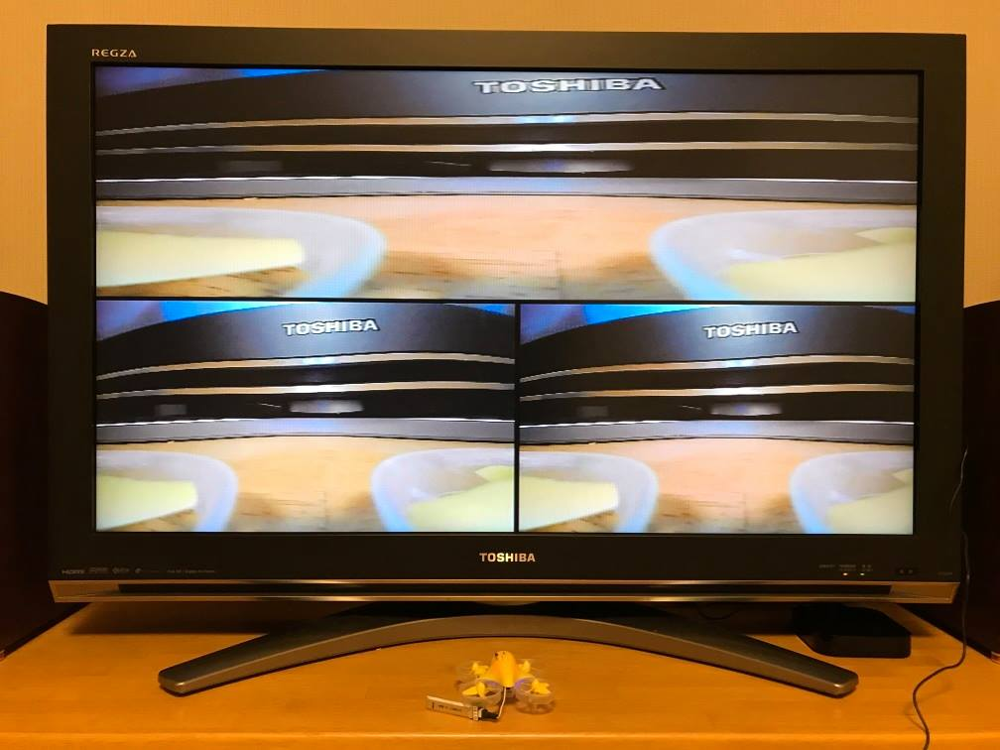

# 常設向け簡易マルチビューアの検討

## はじめに

コンポジット出力付きのFPV映像受信機と、コンポジット対応の映像分割機を組み合わせると、簡易的なマルチビューアシステムを構築できます。PCを使用せず、とにかく安く、簡単に、4分割画面が出せるシステムです。

一方、すでにノートPCを所有していて、表示の自由度や画質、ラップシステムとの連携にこだわりたい方は、[Tiny View Plus](https://github.com/t-asano/tinyviewplus)を中心としたシステムをお勧めします。

なお、この文書を元に起こる不具合について、筆者は一切責任を負いません。リスクを理解した上で、ご活用頂ければ幸いです。

## パーツ構成

| 品名 | 役割 | 参考価格(税込) |
| :-- | :-- | --: |
| [ACアダプター 12V 1A](https://www.marutsu.co.jp/pc/i/743618/) | 電源の供給 | 1,170円 |
| [DCジャック付きケーブル 2.1mm](https://www.marutsu.co.jp/pc/i/594850/) | ACアダプタの接続 | 250円 |
| [エーモン プラス・マイナス分岐ターミナル](https://www.amazon.co.jp/dp/B005LBE5AO) | 電源の分岐 | 470円 |
| [Eachine RC832 × 3個](https://www.banggood.com/ja/Eachine-FPV-5_8G-32CH-Wireless-AV-Receiver-RC832-p-975426.html) | FPV映像の受信 | 4,800円 |
| [MAXWIN AV-400](https://www.amazon.co.jp/dp/B010UOUDMA) | 映像の4分割表示 | 7,320円 |
| 樹脂製ドキュメントケース | 収納、運搬、設置 | 110円 |

参考価格の合計は14,120円(税込、送料別)となります。

### ケーブルの加工

RC832と電源分岐ターミナルを接続するために、RC832付属の電源ケーブルを切断加工して使用します。付属のケーブルを切断したくない場合は、JSTプラグケーブルを用意すると良いでしょう。

RC832と映像分割機を接続するために、RC付属のAVケーブルを使用します。しかしこのケーブルは、今回の用途では長すぎます。短縮加工すれば、見た目もケースへの収まりもスッキリするはずです。

### 映像分割機の選択肢

AV-400の互換品と思われる「[Auto Wayfeng WF® マルチカメラスプリッタ](https://www.amazon.co.jp/Auto-Wayfeng-WF®-マルチカメラスプリッタ/dp/B06XRMBY9P/)」(参考価格:4,300円)という製品も存在します。動作は未検証ですが、問題なく動くのであれば約3,000円のコストダウンが可能です。リスク覚悟でコストを最優先するのであれば、選択肢に入ります。

「[超小型リアルタイムカラー４分割ユニット QUAD-400DX](http://www.akibasecurity.com/quad-400dx.html)」(参考価格:7,480円)という製品も存在します。AV-400と比べると、PIPに対応していたり、PIPを使った3画面表示が可能だったりと、より高機能です。実際に、FPV用途で使われている例もあり、実績重視であればこちらもお薦めです。

## 使用方法

使用方法は以下のとおり、とても簡単です。

1. システム全体の電源を投入
2. RC832の受信周波数を設定
3. 映像分割機の画面分割方法を選択

終了したい場合には、ACアダプタを抜くだけでOKです。

## AV-400での表示例

4分割表示の例です。RC832が電波を受信していない場合や、そもそも映像機器が接続されていない場合は、青画面で表示されます。

本体のボタンやリモコンを用いて、4分割画面とソロ画面を簡単に切り替えられます。

3分割表示では、1つ目の映像が横方向に引き伸ばされます。

## PAL/NTSCの問題

ドローンから送信される映像の方式は、PALだったりNTSCだったりまちまちです。これをRC832で受信すると、入力側と出力側の映像方式が同じとなるようです。つまり、PALで受信すればPALで出力、NTSCで受信すればNTSCで出力されるようです(要検証)。

映像分割機AV-400の入力は、PALとNTSCの両方に対応しており、入力端子1の映像方式が出力側に引き継がれるようです。また、入力側にPALとNTSCが混在した場合にも、映像の分割表示には大きな支障はないようです(要検証)。

先ほど説明したように、AV-400の出力側の映像方式はPALだったりNTSCだったり環境によってまちまちです。一方で、日本で売られているテレビやテレビ放送用レコーダーのコンポジット入力は、NTSCにしか対応していない場合がほとんどです。そのような機器にPALの映像を入力すると、白黒になったり、垂直方向に映像が流れたりします。

これを解決するために、最終段でPALからNTSCへの変換を行います。次に挙げるような、PALとNTSCの両方に対応したコンポジット->HDMIコンバーターでも代用可能です。

| 品名 | 役割 | 参考価格(税込) |
| :-- | :-- | --: |
| [Wavlink AV2HDMI](https://www.amazon.co.jp/gp/product/B073XLY9TJ) | HDMIへの変換 | 1,300円 |

## 4つ目の映像入力の活用

FPVの受信機を3台とする場合、映像分割機の4つ目の入力端子が空くことになります。これについては、以下のような活用方法が考えられます。

- [ラップシステムを入れたRaspberry Pi](pfl_raspi.md)を接続する
- コースの全景等を映すカメラを接続する

## 映像の録画

映像分割機が出力する映像を録画するには、別途機材が必要となります。

コンポジット->HDMIコンバーターを使用している場合は、コンバーターの出力側にHDMI入力に対応した録画機を置きます。一般的なテレビ放送用のレコーダーはHDMI入力に対応していないので、ゲーム録画用として売られている、以下のような製品を使用します。

| 品名 | 役割 | 参考価格(税込) |
| :-- | :-- | --: |
| [IO-DATA GV-HDREC](https://www.amazon.co.jp/dp/B01NBKP6GC) | HDMI映像の録画 | 11,900円 |

映像分割機のコンポジット出力をテレビ放送用のレコーダーに直結して録画する方法もありますが、前述のようにPAL/NTSCの問題が起こりうるため、お薦めできません。